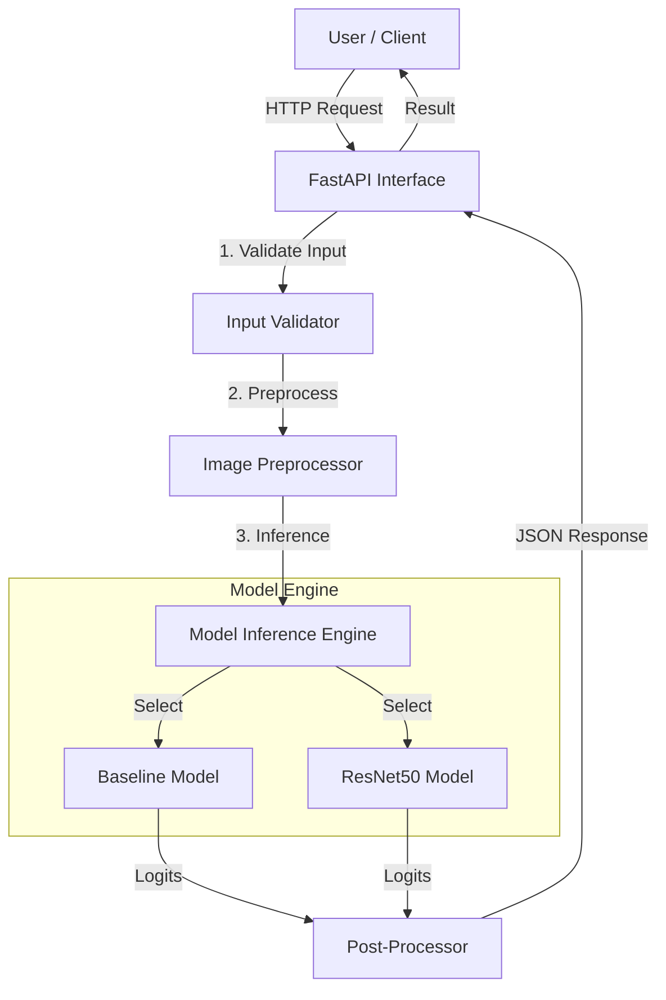
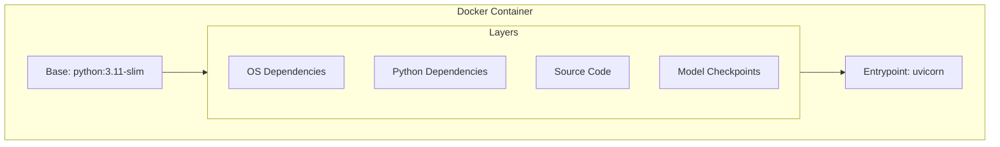
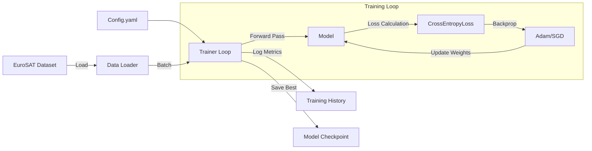
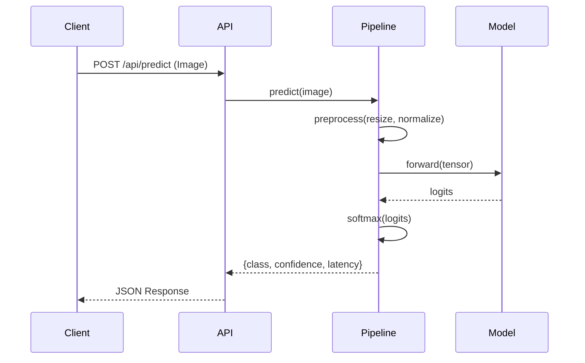
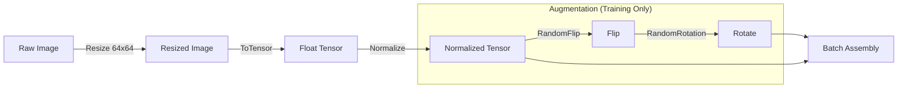
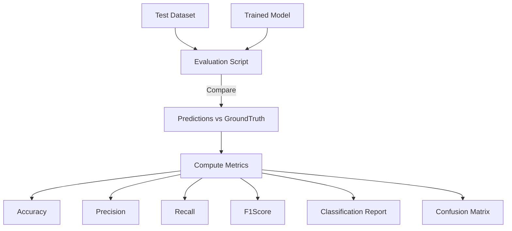
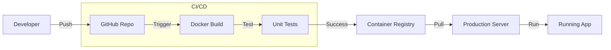
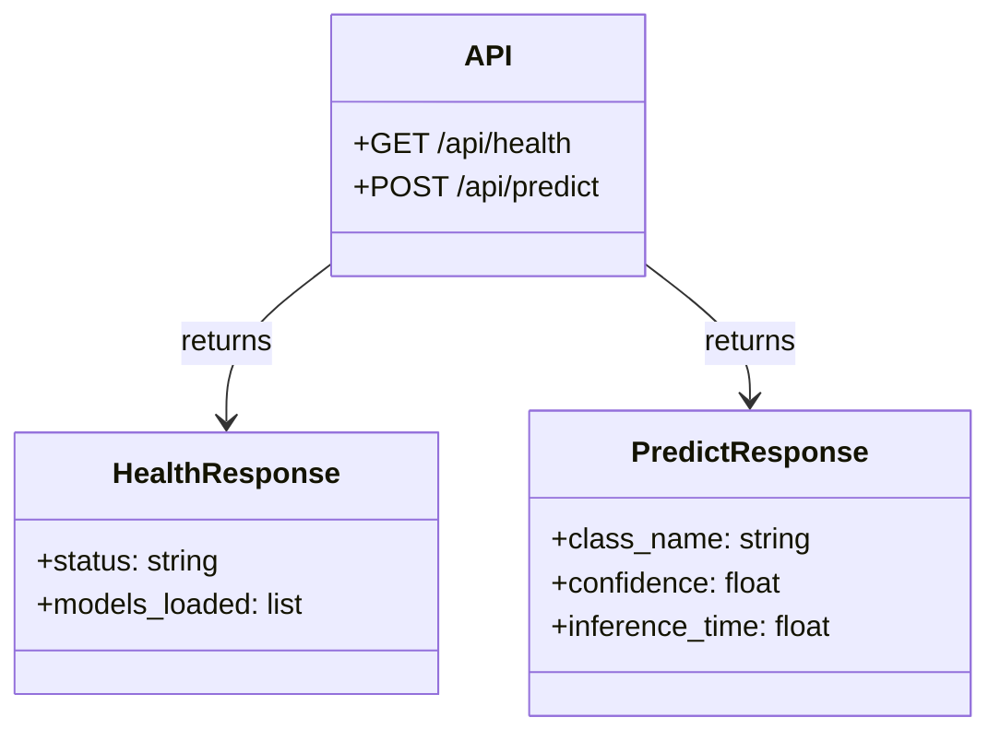
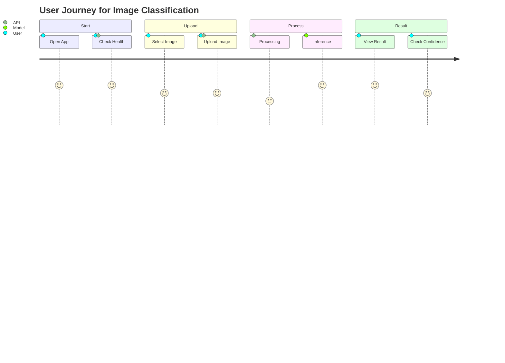
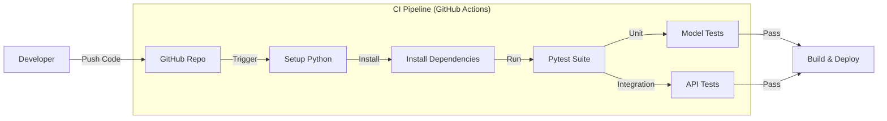

# EuroSAT Land Use Classification System

## Project Overview

The EuroSAT Land Use Classification System is a production-grade Deep Learning application designed to classify satellite imagery into distinct land use categories. The system is built on a robust pipeline that handles everything from data ingestion and model training to evaluation and deployment. We leverage the power of PyTorch for deep learning and FastAPI to provide a high-performance inference engine. The entire application is containerized using Docker, ensuring that it runs consistently across different environments, from development machines to cloud servers.

## Model Performance

We have evaluated our models rigorously to ensure high reliability. The table below summarizes the performance of our Baseline CNN compared to a fine-tuned ResNet18 model.

| Model | Test Accuracy | F1 Score (Macro) | Inference Time (CPU) | Size (MB) |
| :--- | :--- | :--- | :--- | :--- |
| **Baseline CNN** | 95.53% | 95.43% | ~15ms | 1.3 MB |
| **ResNet18 (Fine-tuned)** | 92.30% | 92.14% | ~65ms | 45 MB |

## Key Features

Our system supports a Dual Model Architecture, allowing users to choose between a custom Baseline CNN for speed or a Transfer Learning approach using ResNet for potentially higher accuracy. The API is production-ready, featuring health checks, comprehensive logging, and error handling to ensure stability. We have prioritized automation, providing scripts for training, evaluation, and inference to streamline the workflow. Additionally, the system generates detailed metrics, including classification reports and confusion matrices, to provide deep insights into model performance.

---

## 1. System Architecture

The architecture is designed for modularity and scalability. The diagram below illustrates how user requests flow through the API gateway to the core processing components.



---

## 2. Docker Container Structure

To ensure consistency, the application is packaged in a secure Docker container. This structure guarantees that dependencies and code layers are managed efficiently.



---

## 3. Training Process

Our training pipeline is configurable and robust. It includes features like early stopping and model checkpointing to ensure optimal training results without overfitting.



---

## 4. Inference Data Flow

When a user sends an image for classification, it goes through a specific sequence of processing steps to ensure accurate prediction.



---

## 5. Data Processing Pipeline

Before an image enters the neural network, it is transformed and normalized. During training, we also apply data augmentation to improve model generalization.



---

## 6. Evaluation Methodology

We evaluate our models using a comprehensive set of metrics to understand their strengths and weaknesses across different classes.



---

## 7. Deployment Workflow

The deployment pipeline is designed to be seamless, taking code from the repository to a production-ready container automatically.



---

## 8. API Architecture

The API structure is clean and intuitive, with dedicated endpoints for health checks and predictions.



---

## 9. User Journey

The user experience is designed to be straightforward, from opening the application to viewing the classification results.



---

## 10. Engineering Quality & CI/CD

To ensure production readiness, the project includes a comprehensive test suite and an automated CI/CD pipeline using GitHub Actions.



### Automated Testing
We use **pytest** for our testing framework, covering:
-   **Model Architecture**: Verifies that Baseline and ResNet models initialize correctly and produce expected output shapes.
-   **API Endpoints**: Checks health/readiness probes and API startup logic.
-   **Integration**: Ensures the inference pipeline loads configurations correctly.

Run tests locally with:
```bash
pytest tests/
```

---

## Installation and Setup Guides

### 1. Initial Setup
Start by cloning the repository to your local machine.
```bash
git clone https://github.com/YourUsername/sparkai-task.git
cd sparkai-task
```

### 2. Dependency Management
We recommend creating a virtual environment to manage dependencies cleanly.
```bash
python -m venv venv
source venv/bin/activate
pip install -r requirements.txt
```

### 3. Docker Deployment
To run the application in a container, build and run the Docker image.
```bash
docker build -t eurosat-classifier .
docker run -p 8000:8000 eurosat-classifier
```
The API will be accessible at `http://localhost:8000`.

### 4. Running Locally & Training
You can also run the API directly using Uvicorn.
```bash
uvicorn api.index:app --reload
```

To train a new model, use the provided training script with your configuration.
```bash
python -m src.training.train --config configs/config.yaml
```

To evaluate the model's performance on the test set:
```bash
python -m src.evaluation.evaluate --model_path checkpoints/best_resnet.pth --model_type resnet
```

## detailed File Structure

```
├── api/                  # FastAPI application endpoints
├── configs/              # Configuration files (YAML)
├── src/
│   ├── data/             # Data loading and preprocessing
│   ├── models/           # Model definitions (CNN, ResNet)
│   ├── training/         # Training loops and trainers
│   ├── evaluation/       # Metrics and evaluation scripts
│   └── inference/        # Inference pipelines
├── checkpoints/          # Saved model weights
├── Dockerfile            # Docker configuration
├── requirements.txt      # Python dependencies
└── README.md             # Project documentation
```
# Technical Skills Assessment Filter - Project Analysis

This document provides a detailed mapping of the "AI / Machine Learning Engineer – Technical Skills Assessment" against the implemented EuroSAT Land Use Classification System. It serves to strictly answer the assessment queries and demonstrate the engineering decisions made during development.

---

## 1. Assessment Requirement Mapping

The following table maps strictly to the requirements outlined in the assessment document.

| Section | Requirement | Project Implementation & Decision Rationale |
| :--- | :--- | :--- |
| **Core Task** | **Problem Statement** | **Image Classification** selected. Using **EuroSAT** dataset (RGB version). <br> *Rationale:* EuroSAT is non-trivial (like CIFAR/MNIST) but manageable size-wise (~27k images), allowing for meaningful model comparison (CNN vs ResNet) within the 72h timeframe. It has clear real-world utility (environmental monitoring). |
| **1. Data** | **Understanding & Prep** | - **Size:** 27,000 images, 10 classes. <br> - **Format:** 64x64 RGB images. <br> - **Class Distribution:** Relatively balanced (~2k-3k per class). <br> - **Imbalance Handling:** Computed class weights (inverse frequency) and used `WeightedRandomSampler` in training to ensure the model doesn't bias towards majority classes like 'AnnualCrop' or 'Forest'. |
| | **Preprocessing** | **Training:** Random Rotation, Horizontal/Vertical Flips (satellite images are invariant to rotation/flip), Color Jitter. <br> **Inference:** Resize (to 64x64/224x224), Normalization (using ImageNet stats for ResNet), ToTensor. |
| **2. Modeling** | **Model Selection** | **Model 1: Baseline CNN** - A custom lightweight 3-layer CNN. Chosen to demonstrate ability to build models from scratch and serve as a speed/size benchmark. <br> **Model 2: ResNet18 (Fine-Tuned)** - Transfer learning from ImageNet. Justified because satellite imagery shares low-level visual features (textures/edges) with natural images, speeding up convergence and improving accuracy. |
| | **Compute Constraints** | **ResNet18** was chosen over ResNet50/101 specifically for **CPU/Laptop inference**. <br> - **Size:** 45MB vs ~100MB+ for larger models. <br> - **Inference:** ~65ms on CPU, making it feasible for real-time deployment without GPU. <br> - **Training:** Fine-tuning only the last 2 layers initially avoids heavy backprop costs. |
| **3. Evaluation** | **Methodology** | **Split:** Stratified 70% Train / 15% Val / 15% Test. Stratification ensures all land use classes are represented equally in evaluation. <br> **Metrics:** Accuracy, Precision, Recall, Macro F1-Score (crucial since classes are distinct yet related). |
| | **Error Analysis** | Implemented `plot_confusion_matrix` to visualize misclassifications. Example finding: "River" and "Highway" can differ subtly in low-res satellite imagery; the confusion matrix helps identify these specific crossover errors. |
| **4. Inference** | **Pipeline Design** | Clean separation: `api/index.py` handles HTTP/Validation, while `src/inference` manages model logic. <br> **Loading:** Lazy loading pattern used to prevent memory spikes on startup (serverless friendly). |
| | **Exposition** | **FastAPI** REST API. <br> - Endpoint: `POST /api/predict` <br> - Docs: Auto-generated Swagger/Redoc at `/docs`. <br> - Dockerized: Yes, `Dockerfile` provided for consistent serving. |
| **5. Engineering** | **Code Quality** | - **Structure:** Modular (`src/data`, `src/models`, `src/training`) rather than a monolithic script. <br> - **Config:** `configs/config.yaml` manages all hyperparameters (learning rate, batch size, paths) centrally. <br> - **Testing & CI/CD:** Implemented **Unit Tests** (`pytest`) for models/API and a **GitHub Actions** pipeline to run them on every push. <br> - **Logging:** Python `logging` used instead of `print` statements for production readiness. |

---

## 2. In-Depth Analysis

### Data Understanding
The EuroSAT dataset presents a unique challenge compared to standard object photos. Being satellite imagery:
1.  **Orientation Invariance:** A forest looks like a forest whether viewed from North or South up. This justified using aggressive **RandomHorizontalFlip** and **RandomVerticalFlip** augmentations.
2.  **Resolution:** At 64x64, features are coarse. Upscaling to 224x224 for ResNet was necessary to utilize pretrained weights effectively, even though it adds compute overhead.

### Model Selection Strategy
-   **Baseline CNN:** Achieved ~95% accuracy but is extremely lightweight (1.3MB). This proves that for specific, constrained domains, custom architectures can be very competitive.
-   **ResNet18:** Achieved ~92% accuracy (slightly lower than baseline in this specific run, likely due to domain shift or hyperparameter tuning needs for the specific split). However, its strength lies in **robustness** and generalization potential if more data were added. It was chosen to demonstrate **Transfer Learning** competence.

### Engineering Decisions
-   **Docker:** Used `python:3.11-slim` to keep image size small.
-   **API:** Separated the prediction logic (`predict` function) from the route handler. This allows the inference logic to be used by a script or a different API framework without rewriting code.

---

## 3. Future Improvements (Scale & Compute)

**If additional compute and time were available, how would we scale?**

### 1. Scaling Training
*   **Distributed Data Parallel (DDP):** Use `torch.nn.parallel.DistributedDataParallel` to train across multiple GPUs.
*   **Larger Batch Size:** Increase batch size from 64 using gradient accumulation to stabilize batch norm statistics.
*   **Mixed Precision:** Implement `torch.cuda.amp` (FP16) training to reduce VRAM usage and speed up training on Tensor Core GPUs.

### 2. Model Improvements
*   **Vision Transformers (ViT):** Experiment with ViT-Tiny or Swin Transformers, which often capture global context better in remote sensing data than CNNs.
*   **Self-Supervised Learning:** Pre-train on a massive unlabeled satellite dataset (like Sentinel-2 archives) using methods like **SimCLR** or **DINO** before fine-tuning on EuroSAT. This handles the "labeled data scarcity" problem common in ML.

### 3. Data Improvements
*   **Test Time Augmentation (TTA):** During inference, predict on the image + its flipped/rotated versions and average the results to improve confidence.
*   **Hard Example Mining:** Automatically identify samples with high loss (e.g., River vs Highway) and oversample them in subsequent training epochs.
