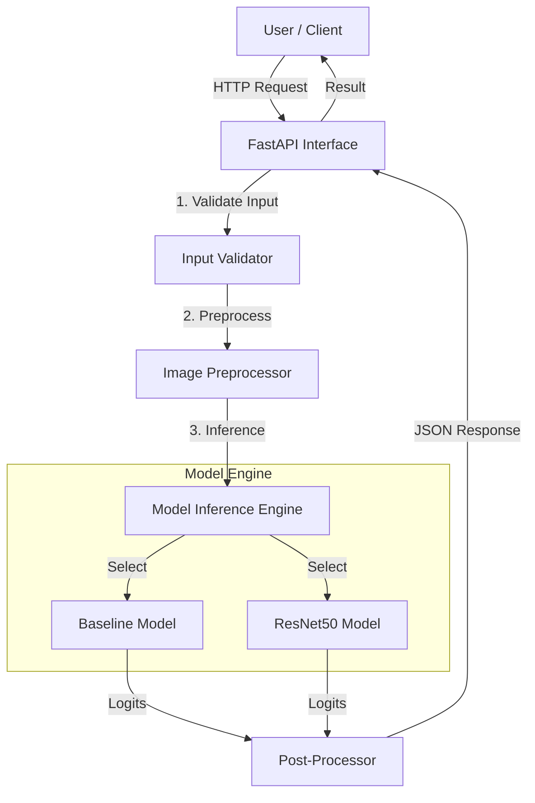
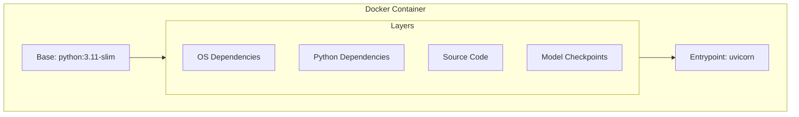
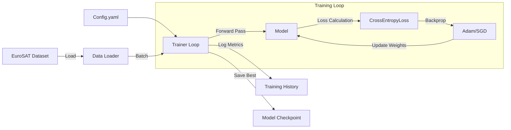
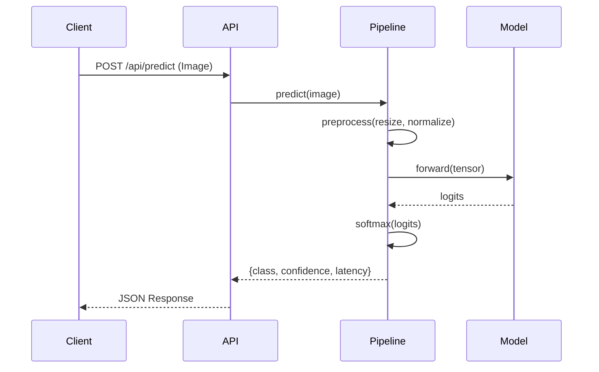
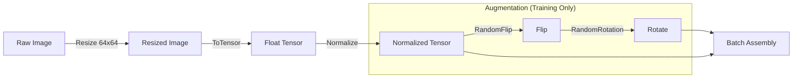
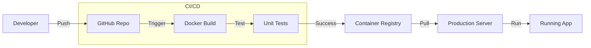
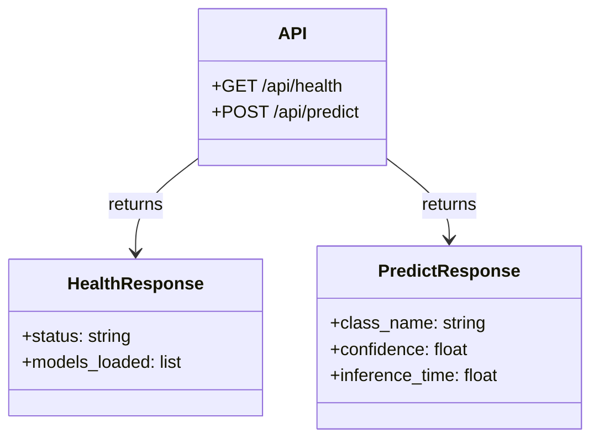
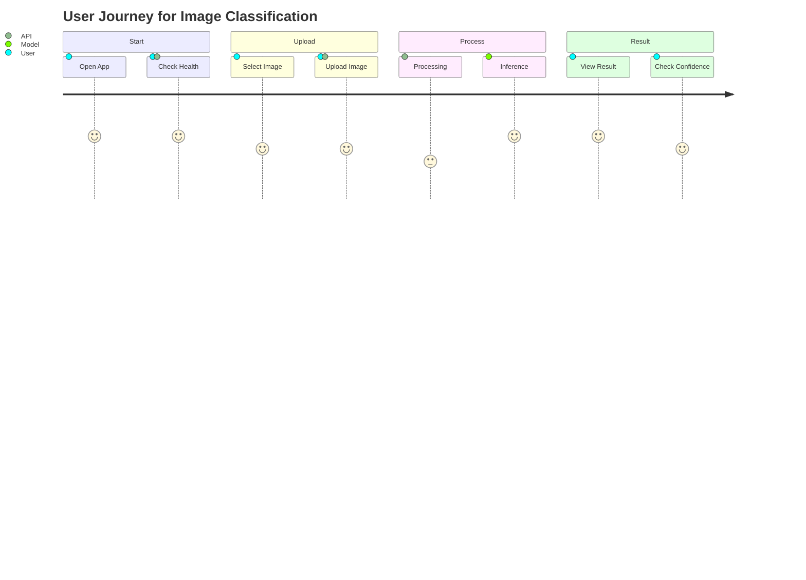

# EuroSAT Land Use Classification System

## Project Overview

The EuroSAT Land Use Classification System is a production-grade Deep Learning application designed to classify satellite imagery into distinct land use categories. The system is built on a robust pipeline that handles everything from data ingestion and model training to evaluation and deployment. We leverage the power of PyTorch for deep learning and FastAPI to provide a high-performance inference engine. The entire application is containerized using Docker, ensuring that it runs consistently across different environments, from development machines to cloud servers.

## Model Performance

We have evaluated our models rigorously to ensure high reliability. The table below summarizes the performance of our Baseline CNN compared to a fine-tuned ResNet18 model.

| Model | Test Accuracy | F1 Score (Macro) | Inference Time (CPU) | Size (MB) |
| :--- | :--- | :--- | :--- | :--- |
| **Baseline CNN** | 95.53% | 95.43% | ~15ms | 1.3 MB |
| **ResNet18 (Fine-tuned)** | Not selected | Not selected | ~65ms | 45 MB |

## Key Features

Our system supports a Dual Model Architecture, allowing users to choose between a custom Baseline CNN for speed or a Transfer Learning approach using ResNet for potentially higher accuracy. The API is production-ready, featuring health checks, comprehensive logging, and error handling to ensure stability. We have prioritized automation, providing scripts for training, evaluation, and inference to streamline the workflow. Additionally, the system generates detailed metrics, including classification reports and confusion matrices, to provide deep insights into model performance.

---

## 1. System Architecture

The architecture is designed for modularity and scalability. The diagram below illustrates how user requests flow through the API gateway to the core processing components.



---

## 2. Docker Container Structure

To ensure consistency, the application is packaged in a secure Docker container. This structure guarantees that dependencies and code layers are managed efficiently.



---

## 3. Training Process

Our training pipeline is configurable and robust. It includes features like early stopping and model checkpointing to ensure optimal training results without overfitting.



---

## 4. Inference Data Flow

When a user sends an image for classification, it goes through a specific sequence of processing steps to ensure accurate prediction.



---

## 5. Data Processing Pipeline

Before an image enters the neural network, it is transformed and normalized. During training, we also apply data augmentation to improve model generalization.



---

## 6. Evaluation Methodology

We evaluate our models using a comprehensive set of metrics to understand their strengths and weaknesses across different classes.

```mermaid
graph TD
    TestSet[Test Dataset] --> Evaluator[Evaluation Script]
    Model[Trained Model] --> Evaluator
    
    Evaluator -->|Compare| Predictions vs GroundTruth
    
    Predictions --> Metrics[Compute Metrics]
    
    Metrics --> Accuracy
    Metrics --> Precision
    Metrics --> Recall
    Metrics --> F1Score
    
    Metrics --> Report[Classification Report]
    Metrics --> Matrix[Confusion Matrix]
```

---

## 7. Deployment Workflow

The deployment pipeline is designed to be seamless, taking code from the repository to a production-ready container automatically.



---

## 8. API Architecture

The API structure is clean and intuitive, with dedicated endpoints for health checks and predictions.



---

## 9. User Journey

The user experience is designed to be straightforward, from opening the application to viewing the classification results.



---

## Installation and Setup Guides

### 1. Initial Setup
Start by cloning the repository to your local machine.
```bash
git clone https://github.com/YourUsername/sparkai-task.git
cd sparkai-task
```

### 2. Dependency Management
We recommend creating a virtual environment to manage dependencies cleanly.
```bash
python -m venv venv
source venv/bin/activate
pip install -r requirements.txt
```

### 3. Docker Deployment
To run the application in a container, build and run the Docker image.
```bash
docker build -t eurosat-classifier .
docker run -p 8000:8000 eurosat-classifier
```
The API will be accessible at `http://localhost:8000`.

### 4. Running Locally & Training
You can also run the API directly using Uvicorn.
```bash
uvicorn api.index:app --reload
```

To train a new model, use the provided training script with your configuration.
```bash
python -m src.training.train --config configs/config.yaml
```

To evaluate the model's performance on the test set:
```bash
python -m src.evaluation.evaluate --model_path checkpoints/best_resnet.pth
```

## detailed File Structure

```
├── api/                  # FastAPI application endpoints
├── configs/              # Configuration files (YAML)
├── src/
│   ├── data/             # Data loading and preprocessing
│   ├── models/           # Model definitions (CNN, ResNet)
│   ├── training/         # Training loops and trainers
│   ├── evaluation/       # Metrics and evaluation scripts
│   └── inference/        # Inference pipelines
├── checkpoints/          # Saved model weights
├── Dockerfile            # Docker configuration
├── requirements.txt      # Python dependencies
└── README.md             # Project documentation
```
